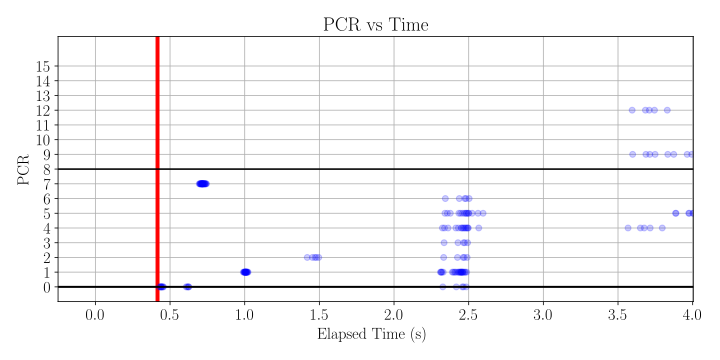
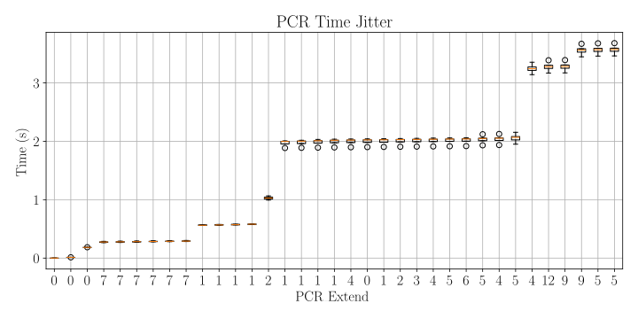
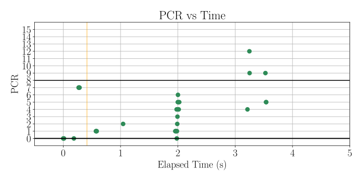

# TPMSpy

This repository contains sources and example data for *TPMSpy: Validation of Measured Boot Systems by Low-Level Tracing of TPM Usage*.

TPMSpy is a software TPM interposer that allows capturing communication between a virtualized system in QEMU and a software TPM.

## Requirements and Dependencies

* Virtualization
  * `libvirt` (See officiall manuals for [Ubuntu](https://documentation.ubuntu.com/server/how-to/virtualisation/libvirt/) or [Fedora](https://docs.fedoraproject.org/en-US/quick-docs/virtualization-getting-started/))
  * [`swtpm`](https://github.com/stefanberger/swtpm) (See [build instructions](https://github.com/stefanberger/swtpm/wiki))

> [!TIP]
> The repository provides a `Containerfile` for Podman which contains all the dependencies for building TPMSpy or analysing the captured data.
> Make sure `podman` or `docker` is available on your platform to use it.

* TPMSpy
  * `libbsd`
  * `libev`
  * `libsodium`
  * `meson`
  * `ninja`
  * `tpm2-tools`

* Capture analysis and graph generators
  * `python3`
  * `matplotlib` for Python 3
  * `yaml` for Python 3

* Nix configuration generator
  * `perl` ≥5.40
  * `Text::Xslate`
  * `YAML::PP`

  This is an optional tool; generated Nix configurations are already provided in this repository.

## Overview

* `auto-collect`: Bash scripts that automate capture collection from a NixOS VM with TPMSpy.
* `data`: Default directory for captured data.
* `nix`: NixOS configuration for default and encrypted volume setups.
* `podman`: Container definition for most of the dependencies.
* `py`: Python scripts for capture analysis and graph creation.
* `ssh`: Default directory for SSH keys used to connect to the VMs.
* `systemd-cryptenroll-doc`: Versions of systemd-cryptenroll documentation source.
* `systemd-news`: Release notes for systemd split by version.
* `tpmspy`: TPMSpy source code (interposer, swtpm auxiliary binary, capture module, dump utility to convert captures to JSON).

## Instructions

1. Clone this repository.
2. Create the podman image.

   ```sh
   cd podman
   podman build --tag tpmspy:latest .
   ```

### Analysis of systemd documentation

The documentation and release news for systemd are provided in `systemd-cryptenroll-doc` and `systemd-news` directories respectively.
The differences in the documentation can be viewed using `diff` or `vimdiff`.

The files can be recreated as follows:

1. Clone the [`systemd`](https://github.com/systemd/systemd) repository (~400 MiB).

   ```sh
   git clone https://github.com/systemd/systemd /tmp/systemd-git
   ```

2. From the root of the repository, extract the documentation files.
   If you cloned the `systemd` repository to a different directory, replace `/tmp/systemd-git` in the first line accordingly.

   ```sh
   podman run --rm -it -v $PWD:/tpmspy -v /tmp/systemd-git:/systemd-git tpmspy \
       /tpmspy/systemd-cryptenroll-doc/extract --from v245 --file man/systemd-cryptenroll.xml /systemd-git
   ```

   The above script can be used to extract any file passed to the `--file` option, but only `man/systemd-cryptenroll.xml` was used for the research.

   For each version, a file `systemd-cryptenroll.$VERSION.xml` is created in the `systemd-cryptenroll-doc`.
   These can be inspected using `diff systemd-cryptenroll.$V1.xml systemd-cryptenroll.$V2` replacing `$V1` and `$V2` by actual versions.

3. Extract the release files.

   ```sh
   podman run --rm -it -v $PWD:/tpmspy \
       make -B -C /tpmspy/systemd-news
   ```

   For each version in the release file, this creates `NEWS-$VERSION.txt` in `systemd-news` directory.
   They can be used to search for `tpm`, `pcr` and other keywords, for example

   ```sh
   grep -EHi '\b(tpm|pcr)\b' systemd-news/NEWS-*.txt
   ```

3. Remove the cloned repository (*optional*).

   ```sh
   rm -rf /tmp/systemd-git
   ```

### Building TPMSpy

> [!WARNING]
> While TPMSpy can be built in the podman container, it must be executed on the host system.
> Therefore, either ensure `musl` is installed on the host system, or simply build TPMSpy outside of podman to avoid linking problems.
> Unfortunately, this requires all dependencies to be installed on the host.

1. Configure the build system.
   If building on the host system outside of podman, `--prefer-static` can be omitted.

   ```sh
   podman run --rm -it -v $PWD:/tpmspy \
       meson setup --prefer-static /tpmspy/tpmspy/build /tpmspy/tpmspy
   ```

2. Build the binaries.

   ```sh
   podman run --rm -it -v $PWD:/tpmspy \
       ninja -C /tpmspy/tpmspy/build
   ```

3. Install the binaries.
   This step must be executed **outside** the container on the host system.

   ```
   meson install --no-rebuild -C tpmspy/build
   ```

   Alternatively, copy the files manually to `/usr/local` so that they are visible in `$PATH` and are picked up by QEMU.
   First, run `readelf -d tpmspy/build/src/tpmspy |grep -i runpath`; the output should contain something like `Library runpath: [$ORIGIN/../lib64:/tpmspy/tpmspy/build/capture]`.
   If the first path contains `lib64` (`$ORIGIN/../lib64`), use `/usr/local/lib64` below; otherwise (`$ORIGIN/../lib`) use `/usr/local/lib`.

   ```sh
   install tpmspy/build/lib/libtpmspy.so tpmspy/build/capture/libcapture.so /usr/local/lib64
   install src/tpmspy swtpm/swtpm /usr/local/bin
   ```

   The original swtpm should still exist as `/usr/bin/swtpm`.

> [!CAUTION]
> If TPMSpy is built or installed incorrectly, virtual machines using TPM may fail to start.
> Try removing TPMSpy in that case and use sample data.

### Configuring virtual machines

1. Download [NixOS minimal ISO image](https://nixos.org/download/#minimal-iso-image).
2. Configure two virtual machines named `nixos-systemd.vm` and `nixos-crypted.vm` and install NixOS and flakes.
   - Instructions for both systems ([`nixos-systemd`](nix/nixos-systemd/nixos-systemd.md) and [`nixos-crypted`](nix/nixos-crypted/nixos-systemd.md)) are available in `nix/nixos-systemd` and `nix/nixos-crypt` respectively.
   - For reference, the VM definition from our setup is exported in `nix/nixos-{systemd,crypted}/machine.xml`, without ISO image.
   - Flakes are found in these directories as well.

### Collecting data

When TPMSpy is installed, it always captures data to `/var/tmp/tpmspy-$TIMESTAMP-$NONCE/packets*.bin`.
The `tpmspy/build/dump/dump --json $PACKETS` command (the `dump` binary is not installed) can be used to convert the packetfile of a **stopped** virtual machine to JSON and later analyzed.

To automate the process, `auto-collect` scripts can automate the data collection.

1. Review and edit `auto-collect/nixos-systemd.cfg` configuration.
   Each value is documented; most likely you will need to update `cfg_ssh_key`.

2. Test that flakes are installed correctly by running `auto-collect/flakes -k`.
   The script should list available flakes.

3. Collect 5 data samples of each systemd version using `auto-collect/experiment 5`.
   The data are stored to directories specified by `cfg_traces_dst` option in the configuration file.

The scripts use `auto-collect/default.cfg`, which is a symlink to the actual configuration.
To switch to a different setup, update the symlink or use `COLLECT_CONFIG` environment variable:

```sh
COLLECT_CONFIG=nixos-crypted.cfg auto-collect/experiment 5
```

The following configurations are available:

- `nixos-systemd.cfg`: Uses `flakes/systemd` on `nixos-systemd` machine for systemd version analysis.
- `nixos-systemd-notpm.cfg`: Disables TPM on one systemd version.
- `nixos-crypted.cfg`: A configuration with and without `systemd-cryptsetup` extending PCR 15.

Captured data are stored in `data/$cfg_traces_dst/$FLAKE/$ID` where `$cfg_traces_dst` is given by configuration, `$FLAKE` is the name of the flake, and `$ID` (`$DATE.$TIME.$NONCE`) is the directory containing a single capture and metadata.

### Sample data

Directory `data/sample` contains small sample (~100 MiB) of captures with generated graphs, some of which are in the paper.

* `data/sample/collect.260104.21`: 5 captures of each systemd version.
* `data/sample/collect.notpm.260105.22`: 1 capture of systemd v250 without TPM support.
* `data/sample/collect.crypt.260105.23`: 2 captures of the encrypted volume setup; with and without systemd-cryptsetup PCR 15 extend.

The samples are complete, except `journal.json` (systemd-journald JSON export) files were removed to decrease the size of the repository.
The `journal.txt` (systemd-journald text export) files are much smaller and retained in the samples.

### Data analysis and graphs

The `py` directory contains scripts that facilitate analysis and graph creation from the collected data.

* `alpha.py -o graph.svg data/$DIR/$FLAKE/*/tpmspy.json`

  Takes one or more `tpmspy.json` from the same flake and creates an “alpha” graph of all the measurements.
  It was used to check for timing deviations in large (N=1000) datasets.

  

* `evlog.py data/$DIR/$FLAKE/$ID/tpmspy.json data/$DIR/$FLAKE/$ID/tpm2-log-platform.txt`

  Takes TPMSpy log (`tpmspy.json`) and TPM Event Log (`tpm2-log-platform.txt`) and cross-references the measurements, complaining if any is missing.

* `hashcheck.py data/$DIR/$FLAKE/*/tpmspy.json`

  Takes one or more TPMSpy captures (`tpmspy.json`) of the same flake and verifies that all the measurements and their order is the same.
  With `-v` outputs the traces.

* `jitter.py -o graph.svg data/$DIR/$FLAKE/*/tpmspy.json`

  Similar to `alpha.py` but produces error bars instead of alpha graphs.
  The _y_-axis denotes time, _x_-axis records the number of PCR extended.
  The script assumes all the input traces are equal (see `hashcheck.py` which checks that).

  

* `pcrstat.py data/$DIR/$FLAKE/$ID/tpmspy.json`

  Takes one TPMSpy capture and tells how many times a PCR was extended.
  This was used for crude analysis of deviations between TPM captures where PCR Extend in graphs was not clearly visible.

* `single.py -o graph.svg data/$DIR/$FLAKE/$ID/tpmspy.json`

  Produces a graph of PCR Extend operations over time for a single capture.
  This script is useful when TPM Event Log is not available (older systems in the dataset); prefer `single2.py` otherwise.

* `single2.py -o graph.svg data/$DIR/$FLAKE/$ID/tpmspy.json data/$DIR/$FLAKE/$ID/tpm2-log-platform.txt`

  Produces a graph of PCR Extend operations over time for a single capture.
  Like `single.py`, but measurements missing in TPM Event Log are displayed as red points.
  See `--help` for more options on how to tweak the graph.

  

## Removal

To remove installed TPMSpy from the host, delete libraries, binaries and captures:

[!CAUTION]
Make sure to read the output of these commands carefully.

```sh
rm -iv /usr/local/lib/lib{64,}{tpmspy,capture}.so
rm -iv /usr/local/bin/{tpmspy,swtpm}
rm -vrf /var/tmp/tpmspy-*
```
